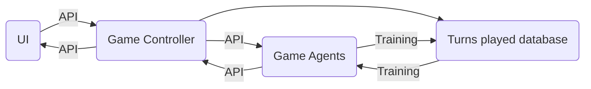

# Atlas.zero
### A machine learning exercise

This exercise has the following components

 1. A python game controller
 2. A Vue UI
 3. A python game agent
 4. A turns played database

# The Game

`totalTurns` = 20
`minMaxAcceptCount` = 5
`fractionalMultiplier` = 0.75

This game wi

In each turn the game will present each player an `offer`.  An `offer` is a random number from 1 to 100.  If the player `accepts` this `offer` it's value is added to thier `final score`.  If the player `rejects` an `offer` a cumulative fractional multiplier will be applied to the `offer` they recieve the next turn.  When a player selects the `accept` action the cumulative fractional multiplier is reset to 0.  

Each player may select the `accept` action a maximum of `minMaxAcceptCount` times per game.  If all `minMaxAcceptCount` `accept` actions have been taken, that players remaining turns are all automatically `wait` actions.  Each player will also automatically take the `accept` action a minimum of `minMaxAcceptCount` times per game.

# The UI

The UI will show the necessary buttons for 2 humans to play eachother locally.  It will also allow a human to play against a random agent or a variety of machine learning trained agents.  It will also allow for queueing of agent vs agent games to be played either in real time with UI or as fast as possible in the backend.

The UI will convert game turn data objects from a `prompt` state to a `response` state.

Vue code got a head-start from [vuexpresso](https://github.com/Ethaan/vuexpresso)

# The Game Controller

The Game Controller will have an api that accepts a turn opbject, validates it and returns the next turn of the game.  The game controller will also cache all incomplete turns until a game is completed, at which time all turns will be sent to the turns database.

The Game Controller will convert game turn data objects from a `response` state to a `prompt` state.

### Validation rules:
For each player to be applied in the response turn object `state`:
- The SUM of [`actions`] must == `currentTurn`
- The SUM of [`accepts`] must be <= `currentTurn`
- The SUM of [`accepts`] must be >= `currentTurn` - (`totalTurns` - `minMaxAcceptCount`)
- The SUM of [`cumulativeScore`] must be == `totalScore`
- The SUM of ( [`fractionalMultiple`]' matrix multipled by [`offers`] = [`adjustedOffers`]; ceil([`adjustedOffers`])' matrix multipled by [`accepts`] ) == `totalScore`
- The SUM of [`rejects`] must be <= `totalTurns` - `minMaxAcceptCount`


# The Agents
1. All Random
2. Gradient Decent / TBD

# The turns played database
The database will be used to train various machine learning agents to play the game.  

```
{
	"gameId": "<unix-timestamp><4-random-numbers>",
	"playerType": "<human, agent-<id>>",
	"playerTurns": {
		"accepts": [`totalTurns`x: <accept = 1>, <else/pending = 0>],
		"waits": [`totalTurns`x: <wait = 1> <else/pending = 0>],
		"rejects": [`totalTurns`x: <reject = 1>, <else/pending = 0>],
		"fractionalMultiple": [`totalTurns`x: <default = 1>, <others>],
		"cumulativeScore": [`totalTurns`x: <integer totalScore>],
		"totalScore": <integer totalScore>,
		"offers": [`totalTurns`x: <default = 0>, <integer rand(1-100)>]
	},
	"oponnentType": "<human, agent-<id>>",
	"opponentTurns": {
		"accepts": [`totalTurns`x: <accept = 1>, <else/pending = 0>],
		"waits": [`totalTurns`x: <wait = 1> <else/pending = 0>],
		"rejects": [`totalTurns`x: <reject = 1>, <else/pending = 0>],
		"fractionalMultiple": [`totalTurns`x: <default = 1>, <others>],
		"cumulativeScore": [`totalTurns`x: <integer totalScore>],
		"totalScore": <integer totalScore>,
		"offers": [`totalTurns`x: <default = 0>, <integer rand(1-100)>]
	},
	"state": <prompt = 0>, <response = 1>
	"currentTurn": <integer 0-`totalTurns`>,
	"winner": <player = 1, oponnent = 0, incomplete = -1>
}
```

# Necessary Diagram

